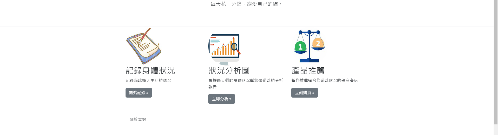
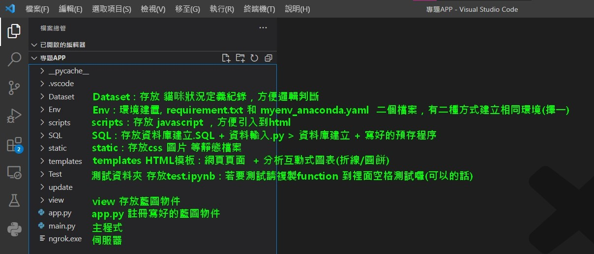

專題網站功能:

GITHUB版本管理教學 
https://backlog.com/git-tutorial/tw/intro/intro2_4.html
 
https://ithelp.ithome.com.tw/articles/10267030

部署平台Render 官方教學
https://render.com/docs/deploy-flask

2023-04-09

更新藍圖物件下，怎麼使用資料庫db或郵件mail 語法

更新load_db.py說明

更新my_log.py : 設定log紀錄設定，記錄使用者行為與程式重要處。

# *README*

### 環境建置

輸出版本套件

* [ ] pip install pipreqs
* [ ] pipreqs --encoding utf-8

環境安裝

* [ ] pip install --upgrade -r  requirements.txt

##### view 資料夾檔案介紹

my_log.py : 設定log紀錄設定，記錄使用者行為與程式重要處。如:

* from view.my_logimportmy_logging
* dev_logger = my_logging()
* dev_logger.info(f"文字訊息{變數}")

config.py : 設定有關任何app的設定 以 DevelopmentConfig開發設定為主 引入到 app

load_db.py : 載入資料庫

* load_files() : 執行載入資料庫檔案/預存程序

plotly_to_web.py : 分析貓咪狀況產生互動式圖表(.html)

recommend.py : 貓咪查詢狀況分析圖表與推薦產品

upload_display_image.py : 未來使用者拍照上傳紀錄貓咪狀況

variable_show_download_file.py : 我能傳入任何東西到網頁，使用者自然也能下載上傳檔案

新電腦(環境建置) : 雲端 -下載 requirements ->  創建資料庫(SQL、py) ->執行SQL資料夾的預存程序(在MSSQL上)

##### 所有.py 執行前流程

* [ ] config.py  改資料庫連線設置   #SQL使用者設置
* [ ] from flask import Flask,Blueprint(藍圖套件)
* [ ] 貓咪狀況紀錄(英文) = Blueprint('貓咪狀況紀錄(英文)', __name__)  #宣告藍圖物件
* [ ] 如果藍圖物件中有要使用db 或 mail, 要

1. from flask import current_app
2. 宣告db or mail物件在全域，並在要執行的函數中 用with current_app.app_context(): 包裹執行區塊

   EX.
   db = SQLAlchemy()

   藍圖物件.route()
   def function():
   with current_app.app_context():
   db.engine.execute(SQL)

* [ ] @貓咪狀況紀錄(英文).route('/自己設置',  methods=['GET', 'POST'])    #創造路徑

  def 函數名稱(參數):                                                      #定義函數名稱(可自己創造)

  做自己的事(.py)

  return render_template('貓咪狀況紀錄(英文).html', **locals())    #.html運用映文的檔名
* [ ] 以上沒問題的話，寫在app.py ( app.register_blueprint(貓咪狀況紀錄(英文)))
